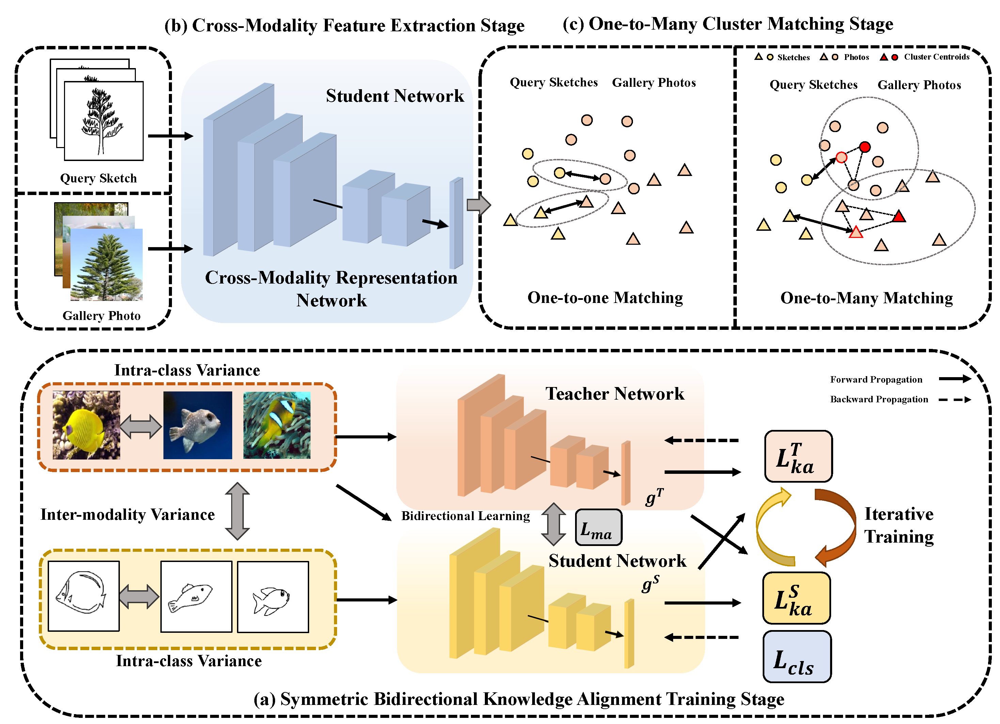

# Symmetrical Bidirectional Knowledge Alignment for Zero-Shot Sketch-Based Image Retrieval

This repository is our implementation of Symmetrical Bidirectional Knowledge Alignment (SBKA) for zero-shot sketch-based image retrieval. More detailed descriptions and experimental results could be found in the [paper](https://arxiv.org/pdf/2312.10320.pdf).



> Abstract: This paper studies the problem of zero-shot sketch-based image retrieval (ZS-SBIR), which aims to use sketches from unseen categories as queries to match the images of the same category. Due to the large cross-modality discrepancy, ZS-SBIR is still a challenging task and mimics realistic zero-shot scenarios. The key is to leverage transferable knowledge from the pre-trained model to improve generalizability. Existing researchers often utilize the simple fine-tuning training strategy or knowledge distillation from a teacher model with fixed parameters, lacking efficient bidirectional knowledge alignment between student and teacher models simultaneously for better generalization. In this paper, we propose a novel Symmetrical Bidirectional Knowledge Alignment for zero-shot sketch-based image retrieval (SBKA). The symmetrical bidirectional knowledge alignment learning framework is designed to effectively learn mutual rich discriminative information between teacher and student models to achieve the goal of knowledge alignment. Instead of the former one-to-one cross-modality matching in the testing stage, a one-to-many cluster cross-modality matching method is proposed to leverage the inherent relationship of intra-class images to reduce the adverse effects of the existing modality gap. Experiments on several representative ZS-SBIR datasets (Sketchy Ext dataset, TU-Berlin Ext dataset and QuickDraw Ext dataset) prove the proposed algorithm can achieve superior performance compared with state-of-the-art methods.

## Environment

The requirements of this repository are listed in the `requirements.txt` .

~~~python
conda create -n sbka python=3.6
pip install -r requirements.txt
~~~

## Datasets

Please download the datasets Sketchy, TU-Berlin, and QuickDraw for ZS-SBIR from [Google Drive](https://drive.google.com/file/d/1IUeNJDlQah6zC5jQPHc2x-HRyNLqTRFK/view?usp=sharing). Please put these three in  `./datasets`.

## Train

### Pretrained ConvNeXtV2 backbone

The pre-trained ConvNeXtV2-Tiny model on ImageNet-1K is provided on [Google Drive](https://drive.google.com/file/d/1H3pHApZZ1TdDfCi5OL7RjIhORGabd7dx/view?usp=sharing). Please put `convnextv2_tiny_1k_224_ema.pt` in ``./pretrained_model`.

### Train SBKA

Train model on Sketchy Ext:

```python
python train_sketchy_ext.py
```

Train model on TU-Berlin Ext:

```py	
python train_tuberlin_ext.py
```

Train model on QuickDraw Ext:

```python
python train_quickdraw_ext.py
```

## Test

### Our Trained SBKA Model

The trained model on Sketchy , Sketchy Split is provided on [Google Drive](https://drive.google.com/drive/folders/1BXNHjCrhS65HHL8T1_t2gXd0Adix2_AA?usp=sharing). 

For Sketchy, please download `zeroshot1/features_zero.pickle` to `./checkpoint/sketchy/zeroshot1`. For Sketchy Split, please download `zeroshot2/features_zero.pickle` to `./checkpoint/sketchy/zeroshot2`.

### Test SBKA

Test model on Sketchy:

```python
python test_sketchy_ext_zeroshot.py
```

Test model on Sketchy Split:

~~~python
python test_sketchy_ext_split_zeroshot.py
~~~

Test model on TU-Berlin:

```python
python test_tuberlin_ext_zeroshot.py
```

Test model on QuickDraw:

```python
python test_quickdraw_ext_zeroshot.py
```

